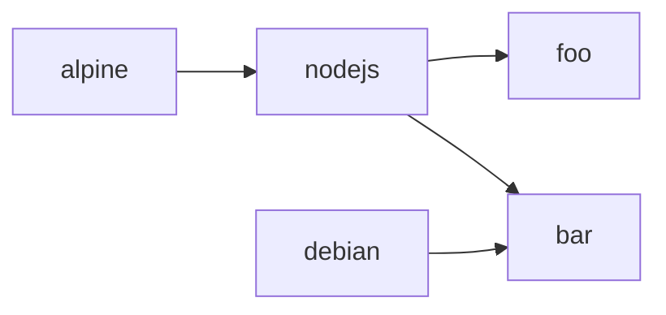
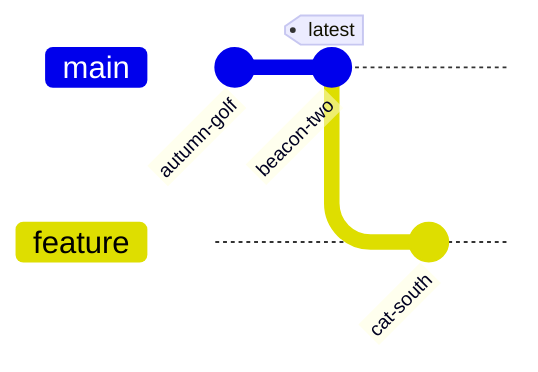
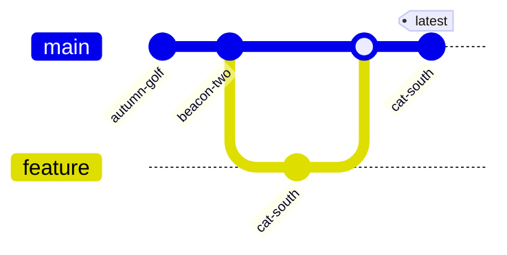

Introduction
============

DIB is a tool designed to help build multiple Docker images defined within a directory, possibly having dependencies
with one another, in a single command.

/// admonition | Warning
    type: warning

DIB is still at an early stage, development is still ongoing and new minor releases may bring some breaking changes. 
This may occur until we release the v1.
///

## Purpose

As containers have become the standard software packaging technology, we have to deal with an ever-increasing number of 
image definitions. In DevOps teams especially, we need to manage dozens of Dockerfiles, and the monorepo is often the 
solution of choice to store and version them.

We use CI/CD pipelines to help by automatically building and pushing the images to a registry, but it's often 
inefficient as all the images are rebuilt at every commit/pull request.
There are possible solutions to optimize this, like changesets detection or build cache persistence to increase 
efficiency, but it's not an easy task.

Also, being able to test and validate the produced images was also something that we were looking forward to.

DIB was created to solve these issues, and manage a large number of images in the most efficient way as possible.

## Concepts

Before using DIB, there are important basic concepts to know about, to understand how it works internally.

### Build Directory

DIB needs a path to a root directory containing all the images it should manage. The structure of this directory is not 
important, DIB will auto-discover all the Dockerfiles within it recursively.

Example with a simple directory structure:
```
images/
├── alpine
|   └── Dockerfile
└── debian
    ├── bookworm
    |   └── Dockerfile
    └── bullseye
        └── Dockerfile
```

In order to be discovered, the Dockerfile must contain the `name` label:
```dockerfile
LABEL name="alpine"
```

If the `name` label is missing, the image will be ignored and DIB won't manage it.

### Dependency Graph

Because some images may depend on other images (when a `FROM` statement references an image also defined within the 
build directory), DIB internally builds a graph of dependencies (DAG). During the build process, DIB waits until all
parent images finish to build before building the children.

Example dependency graph:


In this example, DIB will wait for the `alpine` image to be built before proceeding to `nodejs`, and then both
`alpine` and `bullseye` can be built in parallel (see the [`--rate-limit`](cmd/dib_build.md) build option).

Once `debian` is completed, the build of `bar` begins, and as soon as `nodejs` is completed, `foo` follows.

### Image Version Tag

DIB only builds an image when something has changed in its build context since the last build. To track the changes,
DIB computes a checksum of all the files in the context, and generates a human-readable tag out of it. If any file
changes in the build context (or in the build context of any parent image), the computed human-readable tag changes as 
well.

DIB knows it needs to rebuild an image if the target tag is not present in the registry.

### Placeholder Tag

When updating images having children, DIB needs to update the tags in `FROM` statements in all child images
before running the build, to match the newly computed tag. 

**Example:**

Given a parent image named "parent":
```dockerfile
LABEL name="parent"
```

And a child image referencing the parent:
```dockerfile
FROM registry.example.com/parent:REPLACE_ME
LABEL name="child"
```

When we build using the same placeholder tag:
```shell
dib build \
  --registry-url=registry.example.com \
  --placeholder-tag=REPLACE_ME
```

Then any change to the parent image will be inherited by the child.
By default, the placeholder tag is `latest`.

In some cases, we want to be able to freeze the version of the parent image to a specific tag. To do so, just change the
tag in the `FROM` statement to be anything else than the placeholder tag:
```dockerfile
FROM registry.example.com/parent:some-specific-tag
LABEL name="child"
```

Then any change to the parent image **will not** be inherited by the child.

### Tag promotion

DIB always tries to build and push images when it detects some changes, by it doesn't move the reference tag 
(`latest` by default) to the latest version. This allows DIB to run on feature branches without interfering with
one another. Once the changes are satisfying, just re-run DIB with the `--release` flag to promote the current
version with the reference tag.

**Example workflow**

Let's assume we have a simple GitFlow setup, with CI/CD pipelines running on each commit to build docker images with DIB.

When one creates a branch from the main branch, and commits some changes to an image. DIB builds and pushes the
`cat-south` tag, but `latest` still references the same tag (`beacon-two`):



Once the feature branch gets merged, the `cat-south` tag is promoted to `latest`:


## License

DIB is licensed under the [CeCILL V2.1 License](https://cecill.info/licences/Licence_CeCILL_V2.1-en.txt)
