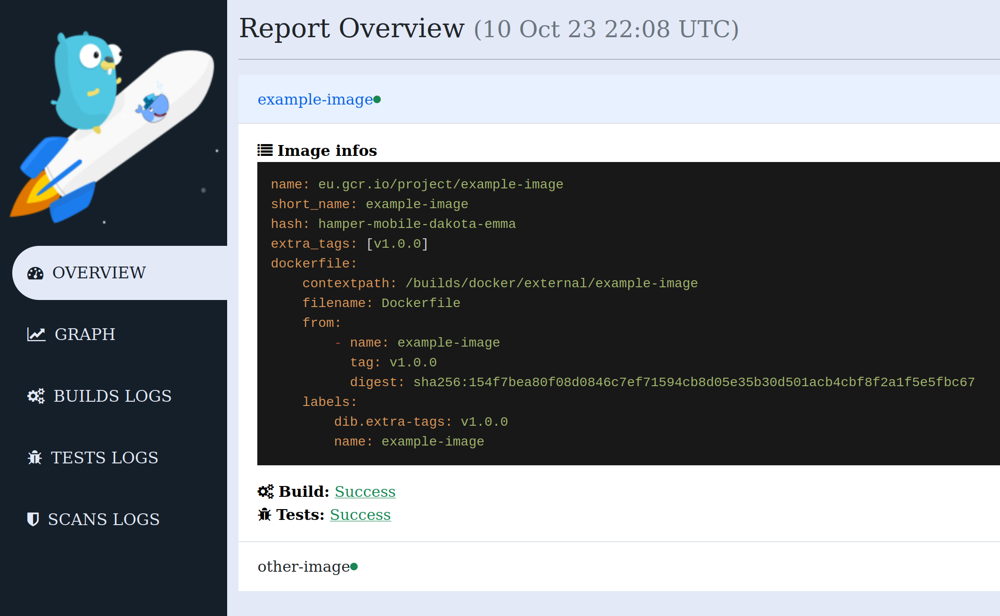

Reporting
=========

dib generates reports after each build.
By default, the reports are generated in the `reports` directory. You can change it by setting the
`--reports-dir` option to another location.

## HTML Report

The HTML report is the one you are going to use the most.
Just click on the link displayed on the dib output to browse the report.

In the report you'll find:

- An overview of all images managed by dib
- The build output
- The graph of dependencies
- Test results and logs
- Vulnerability scan results

**Preview:**

## jUnit Reports

Test executors generate reports in jUnit format. 
They can then be parsed in a CI pipeline and displayed in a user-friendly fashion.
